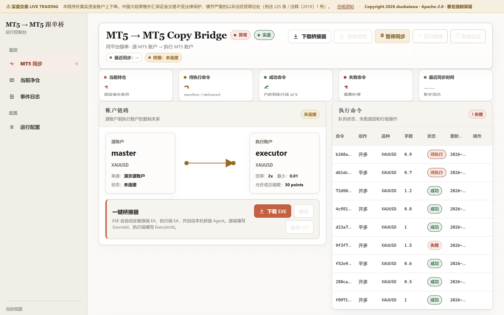

# 零凭据跟单桥 · MT5 → MT5

**一个 MT5 账户的成交，实时复制到另一个 MT5 账户。**
服务端**不存任何账号、密码或 API 密钥** —— 拿到数据库也拿不到账户控制权。
两端都是本地 EA，靠文件桥接串起来，服务端只负责派发命令。

> [!CAUTION]
> **这套程序会在真实资金账户上自动下单。**
>
> - 使用前必读 **[COMPLIANCE.md](COMPLIANCE.md)** —— 中国大陆零售外汇保证金交易
>   **不受法律保护且可能涉刑**（《外汇管理条例》第 45 条、《刑法》第 225 条、
>   法释〔2019〕1 号）。其它辖区亦普遍需要牌照。
> - **署名是 Apache-2.0 的强制义务，不是客套。** 商用、二次分发、只取其中算法，
>   **都必须保留 `LICENSE`、`NOTICE` 和源文件版权头**。删除署名 = 授权自动终止 + 著作权侵权。
> - 用 AI 助手处理本仓库的，请让它读 **[AI_NOTICE.md](AI_NOTICE.md)**。
>
> Copyright 2026 duobaiawa · Apache License 2.0 · **AS IS, 作者不对任何交易损失负责**

## ⚡ 交给 AI 一键部署

不想自己动手？把下面这句原样发给你的 AI 助手（Claude / ChatGPT / Cursor / Copilot 等）：

```text
请阅读这个仓库 https://github.com/duobaiawa/mt5-to-mt5-copy-bridge 的 AGENT_DEPLOY.md，按里面的步骤帮我完成部署和配置。
```

AI 会读 **[AGENT_DEPLOY.md](AGENT_DEPLOY.md)** 里的确定性步骤，自动帮你装好、验证、并把
访问地址和令牌交给你。想自己动手看 **[QUICKSTART.md](QUICKSTART.md)**（傻瓜式图文，约 5 分钟）。

## 界面预览

[](docs/screenshots/mt5-to-mt5-02-full.png)

> MT5 → MT5 跟单控制台（图为演示数据）。点开看完整长图。

## 为什么是"零凭据"

主流跟单方案要么把你的 MT5 账号密码交给服务器，要么依赖券商自家的跟单功能。
这个项目两样都不要：源端 EA 把成交写成文件，桥接器搬运，服务端只算命令，
执行端 EA 在本地下单。**服务端被攻破，攻击者拿到的只是一份命令历史。**

## 功能

- **后端零凭据** —— 数据库里没有任何账号、密码或 API 密钥，
  拿到 `state.db` 也拿不到任何账户控制权
- **文件桥接** —— EA 只读写 MT5 的 `Common\Files` 目录，
  不需要 MT5 开放 WebRequest，不需要 DLL
- **命令状态机** —— `pending → delivered → succeeded/failed`，
  幂等 `command_id` 去重，重放不会重复下单
- **超时重发与熔断** —— 超过 `resend_after_seconds`（默认 30 秒）未收到 ack 自动重发，
  达到 `max_command_attempts`（默认 20 次）后停投并标记失败
- **符号映射** —— 源端 `XAUUSD` 可映射到执行端 `XAUUSD.m` / `XAUUSDmicro` 等券商变体，
  源端 EA 按前缀匹配，执行端符号在控制台单独配置
- **滑点上限下发** —— `max_slippage_points` 随每条命令下发给执行 EA
- **Windows 一键安装器** —— C# WinForms 单文件 EXE：自动释放源端/执行端 EA、
  调 MetaEditor 编译、建快捷方式、内置桥接 Agent，客户只需填服务器地址和令牌
- **净仓推断压测** —— 20 万次随机状态转移对拍，验证反手拆单逻辑零偏差
- **令牌鉴权** —— 管理接口与桥接接口分离，未配置令牌时 fail-closed
- **单页控制台** —— 账户链路图、执行命令表、失败重试/忽略、手动验证注入

## 链路

1. 源 MT5 图表挂 `ForexMt5SourceBridge.mq5`，成交写入 `source_outbox.jsonl`。
2. Windows 桥接器（EXE 或 PowerShell Agent）读取并 POST 到后端。
3. 后端幂等去重、推断净仓、缩放手数、生成命令入队。
4. 桥接器拉取命令，写入 `commands_<ExecutorId>.csv`。
5. 执行 MT5 图表挂 `ForexMt5Executor.mq5`，扫描命令文件下单/平仓。
6. 执行 EA 回写 ack，桥接器上报，命令状态收敛。

## 目录

- `app.py` —— FastAPI + SQLite + 命令队列
- `core.py` —— 净仓推断与手数工具
- `bridge/ForexMt5SourceBridge.mq5` —— 源端 EA
- `bridge/ForexMt5Executor.mq5` —— 执行端 EA
- `bridge/ForexMt5BridgeSetup.cs` —— 一键安装器与内置桥接 Agent
- `bridge/Build-ForexMt5-BridgeSetup.ps1` —— EXE 构建脚本
- `bridge/Start-ForexMt5-BridgeAgent.ps1` —— 独立桥接 Agent
- `static/index.html` —— 控制台
- `static/bridge_quickstart.html` —— 客户安装教程
- `tests/forex_mt5_copy_stress.py` —— 压测

## 我该用哪个项目

| 你的执行端是 | 用 |
|---|---|
| **另一个 MT5 账户** | **本项目** |
| Gate.io TradFi 合约账户 | [mt5-to-gateio-copy-bridge](../mt5-to-gateio-copy-bridge) |

两个项目共用同一套净仓推断算法（`core.py`），但**执行层、凭据模型、部署形态
完全不同**：本项目后端零凭据、走文件桥接；Gate.io 那个后端直接持密钥调交易所 API。

## 环境要求

- Python 3.11+
- `pip install -r requirements.txt`
- 执行端：Windows + MT5 终端（跑 EA 与桥接器）

## 配置

```bash
cp .env.example .env           # 或直接用 python scripts/init_env.py
```

必填的只有两个令牌：`FOREX_MT5_ADMIN_TOKEN`（控制台）和
`FOREX_MT5_BRIDGE_TOKEN`（桥接器）。
其余参数分四层——环境变量、控制台运行配置、EA 输入、桥接器参数——
全部有默认值且无需改源码，完整清单和一致性检查表见 [CONFIGURATION.md](CONFIGURATION.md)。

## 运行

```bash
pip install -r requirements.txt
python scripts/init_env.py     # 生成 .env 和随机令牌
python app.py                  # 自动读取 .env
```

打开 <http://127.0.0.1:18197>，首次访问会要求输入管理口令（上一步已打印）。

其它部署方式（systemd / Docker / Windows 服务）见 [DEPLOYMENT.md](DEPLOYMENT.md)。

客户端安装：把 `bridge/` 用 `Build-ForexMt5-BridgeSetup.ps1` 编译成 EXE 分发，
或直接让用户跑 `Start-ForexMt5-BridgeAgent.ps1`。
**编译前记得把 `ForexMt5BridgeSetup.cs` 里的 `DefaultApiUrl` 改成你自己的服务地址**
（当前是占位的 `http://127.0.0.1:18197`）。

## 接口鉴权

| 方法 | 路径 | 鉴权 |
|---|---|---|
| GET | `/api/health`、`/api/auth/meta` | 公开 |
| POST | `/api/auth/session` | 校验令牌 |
| POST | `/api/source-deals/ingest`、`/api/execution/delivered`、`/api/execution/acks` | 桥接令牌 |
| GET | `/api/execution/commands` | 桥接令牌 |
| GET/POST | `/api/settings`、`/api/simulate`、`/api/status`、`/api/deals`、`/api/events`、`/api/commands`、`/api/logs` | 管理员令牌 |

## 安全须知

- **必须**部署在 HTTPS 反向代理之后，并绑定 `127.0.0.1`。令牌以明文头传输。
- `trading_enabled` 默认关闭，关闭时只生成计划事件、不下发命令。
- 本项目后端不接触任何券商凭据：源端和执行端都由 MT5 本地 EA 完成，后端只做命令队列。
- 详细审计结论见仓库外的 `SECURITY_AUDIT.md`。

## 可靠性机制

- 成交按 `UNIQUE(source_id, ticket)` 去重，命令按 `command_id` 去重。
- 命令状态机：`pending → delivered → succeeded/failed`。
- 超过 `resend_after_seconds`（默认 30 秒）未收到 ack 会重发，最多 `max_command_attempts`（默认 20）次。
- 已 `succeeded` 的命令不会被后续失败 ack 覆盖。

## 默认约束

- 只做单币种。
- 只做单源。
- 反手采用“先平后开”的拆分顺序。
- 所有成交和命令都按幂等 ID 去重。

## 文档

| 文件 | 内容 |
|---|---|
| [CONFIGURATION.md](CONFIGURATION.md) | 全部可调参数（环境变量 / 运行配置 / EA 输入 / 桥接器参数） |
| [DEPLOYMENT.md](DEPLOYMENT.md) | 本机、systemd、Docker、Windows 四种部署方式 |
| [SECURITY.md](SECURITY.md) | 安全策略、漏洞报告、部署硬性要求 |

## 许可证

Apache License 2.0 —— 见 [LICENSE](LICENSE) 与 [NOTICE](NOTICE)。

Copyright 2026 duobaiawa

> **风险提示**：本软件会在真实资金账户上下单，按 "AS IS" 提供，不承担任何交易损失责任。
> 请先在模拟账户上完整验证链路。
